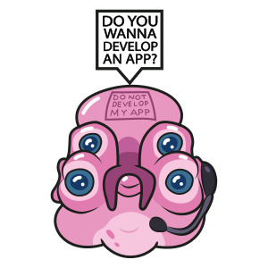

# Rick and Morty - Site protótipo 
<!--  -->
<p align="center">
  <a href="https://github.com/othneildrew/Best-README-Template">
    
  </a>
  <h3 align="center">Rick and Morty API - Protótipo</h3>
  <p align="center">
    CRUD - Consulta api - SPA  
  </p>
</p>
<br>

## Construído com
> ### [React.js][1]
> ### [Laravel][2]
> ### [Inertia.js][3]
> ### [SQLite][4]
> ### [Rick And Morty Api][5]
<br><br>

## Instalação

Clone o repositório:
```sh 
git clone https://github.com/landish/rick-and-morty-vitafor.git
```
Instale as dependências do PHP:
```sh
composer install
```
Instale as dependências do NPM:
```sh
npm install
```
Rode os assets do projeto:
```sh
npm run dev
```

**Duplique** e **renomeie** os seguintes arquivos:
```
.env.example para .env
(Pasta database)
database.sqlite.example para database.sqlite
```

Gere a chave do Laravel:
```sh
php artisan key:generate
```
Rode as tabelas e seeders:
```sh
php artisan migrate --seed
```

## Rode o servidor virtual:
```sh
php artisan serve
```
<br>

## Sobre Autor
Olá meu nome é Jhonata de Souza e atualmente trabalho com desenvolvimento web e estudo para me tornar um engenheiro de software.
<br>
[Linkedin][6]

<!-- [logo]: https://github.com/kissyalone/rick-and-morty-vitafor/blob/master/public/img/glootie.png?raw=true "Glootie" -->
[logo]: public/img/glootie.png "Glootie"
[1]: https://pt-br.reactjs.org/
[2]: https://laravel.com/
[3]: https://inertiajs.com/
[4]: https://www.sqlite.org/index.html
[5]: https://rickandmortyapi.com
[6]: https://br.linkedin.com/in/jhousouza2
